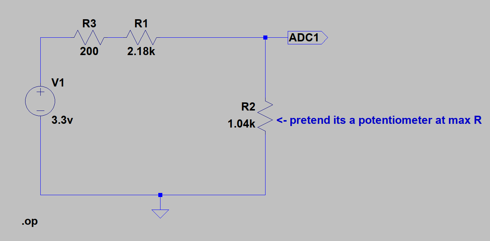

# Project: LED Chaser Speed Control with ADC on Nexys A7-100T

This project demonstrates how adjusting a potentiometer can control the speed of an LED chaser on the **Nexys A7-100T** FPGA board. Using an analog-to-digital converter (ADC) and the **MicroBlaze MCS** processor, this setup varies the delay of an LED chasing sequence based on the analog input voltage. This project leverages the **PoF (Peripherals on FPGA)** system, as outlined in Pong P. Chu's book, and uses a voltage divider to keep input within the ADC’s required range.

## Overview

By turning the potentiometer, the speed of an LED chaser sequence adjusts in real time. The ADC reads the analog voltage from the potentiometer, and based on this input, the delay time for the LED sequence changes. At 0V, the chaser cycle is slowest, with a 1000ms delay between LEDs, while at 1.0V, the cycle is fastest, with only a 50ms delay.

### Hardware Configuration

1. **Board**: Nexys A7-100T FPGA
2. **Processor**: MicroBlaze MCS, configured to read from ADC and control delay times for the LED chaser sequence.
3. **ADC Channel**: Channel 1, as defined by the PoF system in Pong Chu's book.
4. **Voltage Divider**: A voltage divider is created using a 1kΩ potentiometer and a 2.38kΩ resistor to keep the voltage range within 0 to 1V, which is necessary for this ADC setup.
5. **Power Supply**: The potentiometer is powered from the 3.3V and GND pins on the same PMOD port used by the ADC.

### Voltage Divider Details

The voltage divider ensures that the potentiometer output stays within the ADC’s 0 to 1V input range. This is essential to keep the input voltage within bounds for a single ADC channel configured for this experiment.

### LED Chaser Speed Control

The project maps the 0 to 1V analog input to control the delay time for the LED chaser sequence:
- **0V**: Sets the delay to 1000ms (1 second) between LEDs, resulting in a slower chase speed.
- **1.0V**: Sets the delay to 50ms, resulting in a rapid chase speed.
- **Intermediate Voltages**: Intermediate values between 0 and 1V create proportional delay values, smoothly adjusting the speed of the chaser.

### Project Workflow

1. **ADC Reading**: The system reads the analog voltage on ADC Channel 1. This voltage varies between 0 and 1V, based on the potentiometer's position.
2. **Voltage Mapping**: The voltage reading is scaled to correspond to a delay range between 50ms and 1000ms.
3. **LED Chaser Control**: The delay is applied to a simple LED chaser sequence on the Nexys A7-100T, allowing real-time adjustment of the chaser speed as the potentiometer is turned.

### Expected Outcome

Turning the potentiometer will cause the LED chaser to cycle through its sequence at varying speeds, from slow (1000ms delay per LED) to fast (50ms delay per LED). This project highlights the practical use of analog-to-digital conversion, time delay control, and LED manipulation on the Nexys A7-100T, providing a visual, real-time interaction between analog input and digital output.
